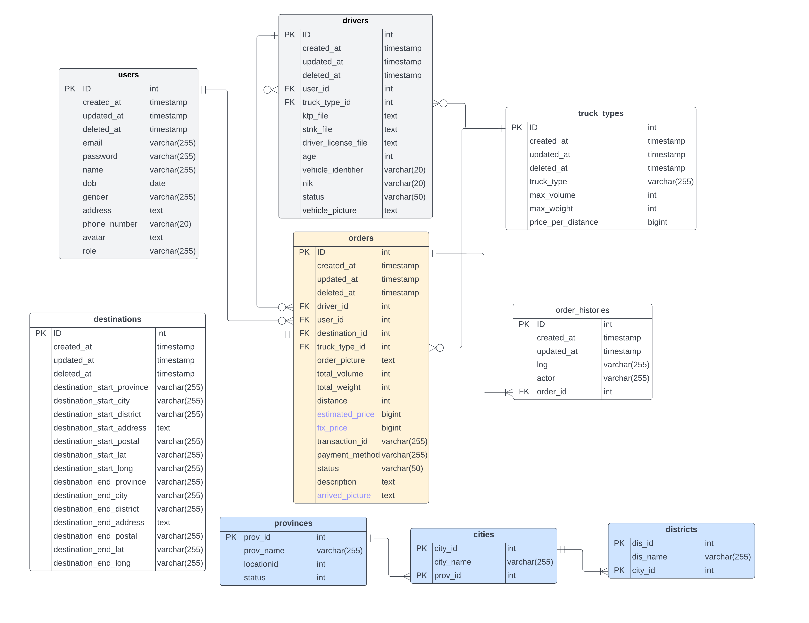

<div id="top"></div>

<!-- PROJECT LOGO -->
<br/>
<div align="center">
<!--  mengarah ke repo  -->
  <a href="https://github.com/ALTA-Bringeee-Group1/Bringeee-API">
    
  </a>

  <h3 align="center">Bringeee</h3>

  <p align="center">
    Final Project Capstone Program Immersive Alterra Academy
    <br />
    <a href="https://app.swaggerhub.com/apis-docs/wildanie12/Bringee-API/v1.2#/"><strong>Explore the docs Open API »</strong></a>
    <br />
  </p>
</div>

<!-- ABOUT THE PROJECT -->
## About The Project 

Bringeee adalah sebuah aplikasi kargo untuk mengangkut barang dengan 1 truck berdasarkan berat dan volume barang yang anda akan kirimkan.

Berikut fitur yang terdapat dalam Bringeee :
| Feature | Admin | Customer | Driver | Guest
|:----------| :----------:| :----------:|:----------:|
| Signup | No | No | No | Yes
| Login | Yes | Yes | Yes | No
|---|---|---|---|
| Get all customers | Yes | No | No | No
| Get customer by id | Yes | Yes | No | No
| Update customer by id | No | Yes | No | No
| Delete customer by id | Yes | Yes | No | No
|---|---|---|---|
| Get all drivers | Yes | No | No | No
| Get driver by id | Yes | No | Yes | No
| Update driver by id | Yes | No | Yes | No
| Delete driver by id | Yes | No | No | No
| Verified driver account | Yes | No | No | No
|---|---|---|---|
| Create order | No | Yes | No | No
| Get all orders | Yes | No | No | No
| Get all orders by truck type | Yes | No | Yes | No
| Get order by id | Yes | Yes | Yes | No
| Confirm order | Yes | Yes | No | No
| Cancel order | Yes | Yes | No | No
| Set fixed price order | Yes | Yes | No | No
| Estimate price | No | Yes | No | No
| Take order | No | No | Yes | No
| Finish order | No | No | Yes | No
|---|---|---|---|
| Create Payment | No | Yes | No | No
| Get Payment | No | Yes | No | No
| Cancel Payment | No | Yes | No | No
|---|---|---|---|
| Orders Count | Yes | No | No | No
| Drivers Count | Yes | No | No | No
| Customers Count | Yes | No | No | No
| Truck type Count | Yes | No | No | No
| Orders count by period day | Yes | No | No | No
| Monthly Report | Yes | No | No | No
|---|---|---|---|

<p align="right">(<a href="#top">back to top</a>)</p>

### Built With

- [Golang](https://golang.org/)
- [Echo Framework](https://echo.labstack.com/)
- [MySQL](https://www.mysql.com/)
- [Gorm](https://gorm.io/)
- [JWT](https://echo.labstack.com/cookbook/jwt)
- [Assert](https://pkg.go.dev/github.com/stretchr/testify/assert)
- [VS Code](https://code.visualstudio.com/)
- [Distance Matrix](https://www.distancematrixapi.com/)
- [Midtrans](htpps://www.midtrans.com/)

<p align="right">(<a href="#top">back to top</a>)</p>

<!-- GETTING STARTED -->
## Getting Started

This is an example of how you may give instructions on setting up your project locally.
To get a local copy up and running, follow these simple example steps.

### Prerequisites

This is an example of how to list things you need to use the software and how to install them.
* Install Golang, Mysql, and Postman for testing
* create an `.env` file

```bash
    APP_PORT= "8000"
    APP_BASE_URL= "127.0.0.1:8000"
    APP_ENV=development 
    DB_HOST= "127.0.0.1"
    DB_PORT= "3306"
    DB_USERNAME= "root"
    DB_PASSWORD= ""
    DB_NAME= "capstone"
```

### Installation

1. Clone the repo (in Folder htdocs)
```sh
git clone https://github.com/ALTA-Bringeee-Group1/Bringeee-API.git
```
2. Install module with get
```sh
go get
go mod tidy
```
3. Run
```sh
source .env
go run main.go
```
4. Access via url
```JS
localhost:port
```
<p align="right">(<a href="#top">back to top</a>)</p>

## ERD

<p align="right">(<a href="#top">back to top</a>)</p>

<!-- CONTACT -->
## Contact

Project Link : [https://github.com/ALTA-Bringeee-Group1/Bringeee-API](https://github.com/ALTA-Bringeee-Group1/Bringeee-API)<br/>
Open API Documentation : [https://app.swaggerhub.com/apis-docs/wildanie12/Bringee-API/v1.2#/](https://app.swaggerhub.com/apis-docs/wildanie12/Bringee-API/v1.2#/)&nbsp;

<!-- :heart: -->
<!-- CONTRIBUTOR -->
Contributor :
<br>
[](https://github.com/wildanie12)

[](https://github.com/mnasruls)

<p align="right">(<a href="#top">back to top</a>)</p>
<h3>
<p align="center">:copyright: 2022 | Built with :heart: from us</p>
</h3>
<!-- end -->