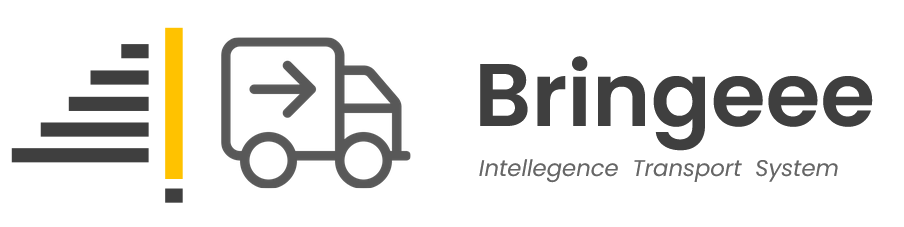
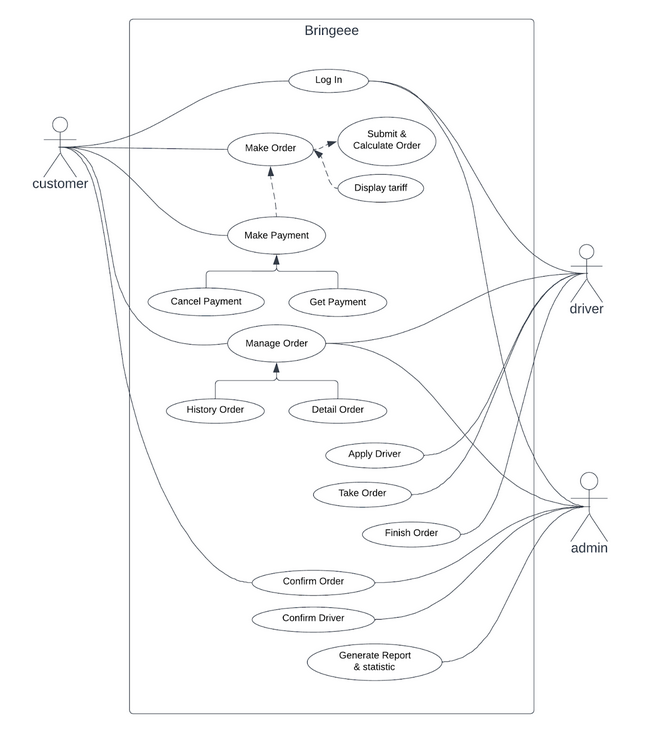

<!-- PROJECT LOGO -->
 

<!--  mengarah ke repo  -->
  

  <h3 align="center">Bringeee</h3>

  

    Final Project Capstone Program Immersive Alterra Academy
     
    <a href="https://app.swaggerhub.com/apis-docs/wildanie12/Bringee-API/v1.2#/"><strong>Explore the docs Open API »</strong></a>
     
     
    
    
  

 

<!-- ABOUT THE PROJECT -->

## 💻 About The Project

Bringeee adalah sebuah aplikasi kargo untuk mengangkut barang dengan 1 truck. Harga untuk sebuah order dihitung berdasarkan jarak dari lokasi pengambilan order hingga ke tujuan pengiriman.

Berikut fitur yang terdapat dalam Bringeee :

      

🙎 Customers

  
  <!---
  | Command | Description |
| --- | --- |
  --->
  
 Di Customer terdapat fitur untuk membuat Akun dan Login agar mendapat legalitas untuk mengakses berbagai fitur lain di aplikasi, 
 terdapat juga fitur Update untuk mengedit data yang berkaitan dengan customer, serta fitur delete berfungsi jika customer menginginkan hapus akun.
 

  
| Feature Customer | Endpoint | Param | JWT Token | Fungsi |
| --- | --- | --- | --- | --- |
| POST | /api/customers  | - | NO | Melakukan proses registrasi customer |
| POST | /api/auth | - | NO | Melakukan proses login customer |
| GET | /api/auth/me | - | YES | Mendapatkan informasi customer yang sedang login |
| PUT | /api/customers | - | YES | Melakukan update informasi customer yang sedang login | 
| DEL | /api/customers | - | YES | Menghapus customer yang sedang login |
| POST | /api/customers/orders | - | YES | Membuat sebuah order |
| POST | /api/customers/orders/estimate | - | YES | Melihat perkiraan harga sebuah orderan |
| GET | /api/customers/orders | status order | YES | Mendapatkan semua order berdasarkan status order customer |
| GET | /api/customers/orders/{orderID} | orderID | YES | Mendapatkan detail sebuah order customer |
| GET | /api/customers/orders/{orderID}/histories | orderID | YES | Mendapatkan timeline dari sebuah order |
| POST | /api/customers/orders/{orderID}/confirm | orderID | YES | Mengkonfirmasi sebuah order jika terjadi penyesuaian harga dari admin |
| POST | /api/customers/orders/{orderID}/cancel | orderID | YES | Membatalkan sebuah order |
| POST | /api/customers/orders/{orderID}/payment | orderID | YES | Memilih jenis pembayaran yang akan digunakan |
| POST | /api/customers/orders/{orderID}/payment/cancel | orderID | YES | Membatalkan jenis pembayaran |
| GET | /api/customers/orders/{orderID}/payment | orderID | YES | Mendapatkan jenis pembayaran yang digunakan oleh customer |

🚚 Driver

  
  <!---
  | Command | Description |
| --- | --- |
  --->
  
 Di Driver terdapat fitur untuk membuat Akun dan Login agar mendapat legalitas untuk mengakses berbagai fitur lain di aplikasi, 
 terdapat juga fitur Update untuk mengedit data yang berkaitan dengan driver, serta fitu - fitur lainnya.
 

  
| Feature Driver | Endpoint | Param | JWT Token | Fungsi |
| --- | --- | --- | --- | --- |
| POST | /api/drivers  | - | NO | Melakukan proses registrasi driver |
| POST | /api/auth | - | NO | Melakukan proses login driver |
| GET | /api/auth/me | - | YES | Mendapatkan informasi driver yang sedang login |
| PUT | /api/drivers | - | YES | Melakukan update informasi yang tidak credential driver yang sedang login | 
| GET | /api/drivers/orders | - | YES | Mendapatkan semua order berdasarkan tipe truck driver |
| GET | /api/drivers/current_order | - | YES | Mendapatkan order yang sedang diantar oleh driver |
| GET | /api/drivers/history_orders | - | YES | Mendapatkan order yang telah diantar oleh driver |
| GET | /api/orders/{orderID} | orderID | YES | Mendapatkan detail sebuah order |
| POST | /api/drivers/orders/{orderID}/take_order | orderID | YES | Mengambil sebuah orderan untuk diantarkan ke tujuan |
| POST | /api/drivers/orders/{orderID}/finish_order | orderID | YES | Menyelesaikan sebuah orderan dengan mengupload foto pada saat diterima customer |

 

🖥️ Admin

  
  <!---
  | Command | Description |
| --- | --- |
  --->
  
 Di Admin terdapat fitur untuk melakukan manajemen customer, driver, order dan fitur statistik serta laporan order perbulannya.
 

  
| Feature Admin | Endpoint | Param | JWT Token | Fungsi |
| --- | --- | --- | --- | --- |
| POST | /api/auth | - | NO | Melakukan proses login admin |
| GET | /api/auth/me | - | YES | Mendapatkan informasi admin yang sedang login |
| GET | /api/customers | (optional) | YES | Mendapatkan list customer |
| GET | /api/drivers | (optional) | YES | Mendapatkan list driver |
| GET | /api/orders | (optional) | YES | Mendapatkan list order |
| GET | /api/orders/{orderID}/histories | orderID | YES | Mendapatkan timeline sebuah order |
| POST | /api/orders/{orderID}/confirm | orderID | YES | Mengkonfirmasi sebuah order jika tidak ada penyesuaian harga |
| POST | /api/orders/{orderID}/cancel | orderID | YES | Membatalkan sebuah order |
| GET | /api/orders/{orderID} | orderID | YES | Mendapatkan detail sebuah order |
| PATCH| /api/orders/{orderID} | orderID | YES | Melakukan penyesuaian harga pada sebuah order | 
| POST | /api/drivers/{driverID}/confirm | driverID | YES | Mengverifikasi akun driver |
| GET | /api/drivers/{driverID} | driverID | YES | Mendapatkan detail profile driver |
| PUT | /api/drivers/{driverID} | driverID | YES | Melakukan update informasi yang credential pada akun driver | 
| DEL | /api/drivers/{driverID} | driverID | YES | Menghapus akun driver | 
| GET | /api/customers/{customerID} | customerID | YES | Mendapatkan detail profile customer |
| DEL | /api/customers/{customerID} | customerID | YES | Menghapus akun customer | 
| GET | /api/stats/aggregates/orders_count | (optional) | YES | Mendapatkan jumlah semua order |
| GET | /api/stats/aggregates/drivers_count | (optional) | YES | Mendapatkan jumlah semua driver |
| GET | /api/stats/aggregates/truck_types_count | - | YES | Mendapatkan jumlah semua tipe truck |
| GET | /api/stats/aggregates/customers_count | - | YES | Mendapatkan jumlah semua customer |
| GET | /api/stats/orders/{day} | day | YES | Mendapatkan jumlah order berdasarkan periode hari yang di inginkan |
| POST | /api/export/orders | - | YES | Membuat file excel laporan order perbulan |

(<a href="#top">back to top</a>)

### Built With

### 🛠 &nbsp;Build App & Database

&nbsp;
&nbsp;
&nbsp;
&nbsp;
&nbsp;
&nbsp;
&nbsp;
&nbsp;
&nbsp;
&nbsp;
&nbsp;
&nbsp;
&nbsp;
&nbsp;
&nbsp;
&nbsp;
&nbsp;
&nbsp;

(<a href="#top">back to top</a>)

## 🗃️ ERD

(<a href="#top">back to top</a>)

## 📑 Use Case Diagram

(<a href="#top">back to top</a>)

<!-- CONTACT -->

## 📱 Contact

Project Repository Link : [https://github.com/ALTA-Bringeee-Group1/Bringeee-API](https://github.com/ALTA-Bringeee-Group1/Bringeee-API) 
Open API Documentation : [https://app.swaggerhub.com/apis-docs/wildanie12/Bringee-API/v1.2#/](https://app.swaggerhub.com/apis-docs/wildanie12/Bringee-API/v1.2#/)&nbsp;

<!-- :heart: -->
<!-- CONTRIBUTOR -->

Contributor :
 

(<a href="#top">back to top</a>)

<h3>

:copyright: 2022 | Built with :heart: from us

</h3>
<!-- end -->
